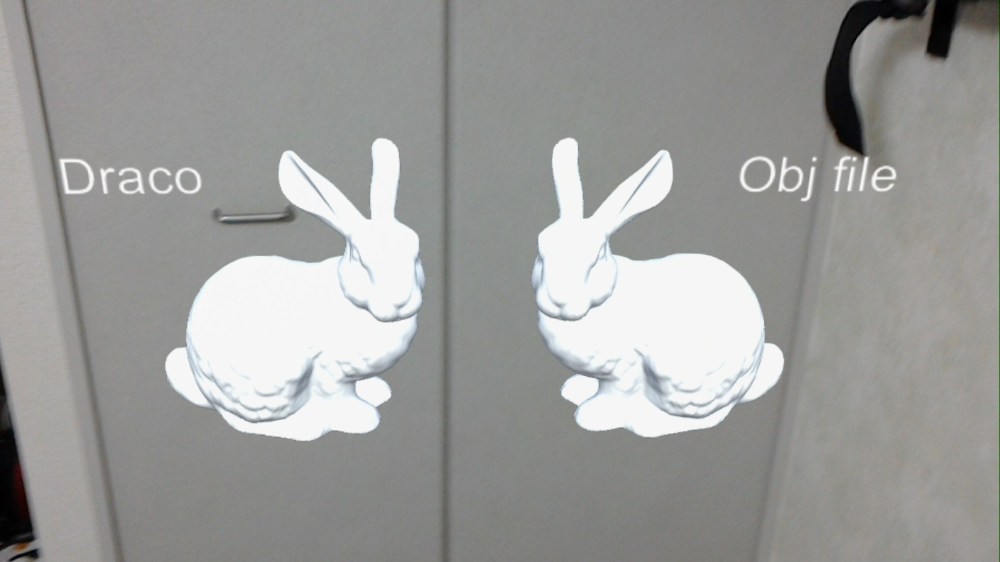

# Draco Sample for HoloLens

## What is Draco?
Draco is a library for compressing and decompressing 3D geometric meshes and point clouds. It is intended to improve the storage and transmission of 3D graphics. https://google.github.io/draco/

## Draco decoder plugins
This project includes draco decoder plugins for Windows and HoloLens(UWP).  
These build from current latest version of master branch. https://github.com/google/draco/tree/affc0ad8889e16ab34332192c57f7259ce61912f

## Test data
This project includes test data in `Assets/Resources/`.
- bunny_norm.obj (4,930,097 bytes)
- bunny.drc (108,924 bytes)

## Tested Environment
- Windows 10 Pro (OS build 16299.431)
- Unity 2017.4.2.f2
- Visual Studio 2017 (Version 15.6.6)
- HoloLens (OS build 10.0.17134.1000)
